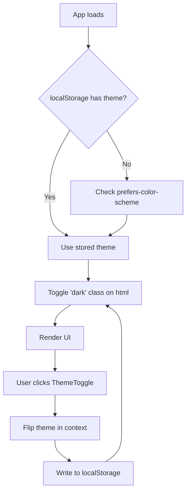

# Add Dark Mode Toggle to React App

## 1. Problem

Users have no way to switch the app between light and dark themes, and any theme choice does not survive a page reload. We need a visible toggle, a clean way to apply theme styles across the component tree, and persistence in `localStorage` so the preference sticks across sessions and tabs.

## 2. Approach

Start in **Plan Mode** so the structure is agreed before any code lands. Use the **Explore subagent** (medium breadth) to locate the current theme/styling setup — Tailwind config, CSS variables, or a styled-components ThemeProvider — and to find the top-level layout component where a provider should wrap the tree.

Implementation outline:

1. Add a `ThemeContext` with `theme` (`'light' | 'dark'`) and a `toggleTheme` function.
2. On mount, read `localStorage.getItem('theme')`; fall back to `window.matchMedia('(prefers-color-scheme: dark)')`.
3. Apply the theme by toggling a `dark` class on `document.documentElement` (works for Tailwind and CSS-variable setups).
4. Persist every change to `localStorage` and listen to the `storage` event so multiple tabs stay in sync.
5. Add a small `ThemeToggle` button in the header with an accessible label and an icon swap.

Before committing, run the **simplify skill** for a quality pass, then **/review** on the PR. Save the chosen theming convention (class strategy, storage key, default behavior) via **Auto-memory** so future sessions don't relitigate it.

## 3. Files to change

- `src/contexts/ThemeContext.tsx` — new provider + hook.
- `src/components/ThemeToggle.tsx` — new toggle button.
- `src/App.tsx` (or root layout) — wrap with `ThemeProvider`.
- `src/index.css` / `tailwind.config.js` — ensure `darkMode: 'class'` and dark variants on key surfaces.
- `index.html` — small inline script to set the class pre-hydration and avoid a flash.

## 4. Flow

## 5. Risks

- **Flash of wrong theme (FOUC)** on first paint — mitigate with the inline pre-hydration script in `index.html`.
- **SSR / hydration mismatch** if the project uses Next.js — guard `window` and `localStorage` access. Use the **Explore subagent** to confirm whether SSR is in play.
- **Cross-tab drift** — handled by the `storage` event listener.
- **Stale dark styles** on existing components — sweep with the Explore subagent for hardcoded colors. No auth, network, or credentials touched, so **/security-review** is not required here.

## 6. Approval

Approve this plan to exit Plan Mode and begin implementation.
