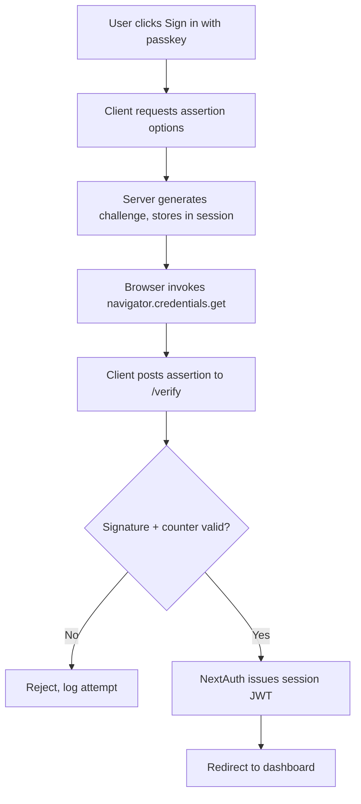

# Add Passkeys to NextAuth Flow

## 1. Problem

Our Next.js SaaS currently authenticates users via NextAuth.js with password credentials. We want passkeys (WebAuthn) as a first-class, additive method — users keep passwords but can register one or more passkeys and use them on subsequent logins. Auth is high-blast-radius code: session shape, callbacks, middleware, and DB schema all touch each other, so the refactor needs careful scoping before any edits.

## 2. Approach

Start in **Plan Mode** so nothing gets written until the design is agreed. Use the **Explore subagent** (breadth: very thorough) to map every reference to `next-auth`, `getServerSession`, `authOptions`, and the current credentials provider — this surfaces hidden callers in middleware, API routes, and tests.

Then hand the findings to the **Plan subagent** to produce a step-by-step migration that:

1. Adds a `WebAuthnCredential` table (publicKey, counter, transports, userId, label, createdAt).
2. Wires a custom WebAuthn provider into NextAuth using `@simplewebauthn/server` for registration + assertion ceremonies.
3. Adds `/api/auth/passkey/register/(options|verify)` and `/api/auth/passkey/login/(options|verify)` route handlers.
4. Builds settings UI for managing enrolled passkeys (label, remove, last-used).
5. Keeps the password provider intact; both methods produce the same session shape.

Run **/init** if the repo doesn't already have a CLAUDE.md so the assistant understands the project conventions. Use **Auto-memory** to record the chosen WebAuthn library, RP ID, and origin policy — these get re-asked every session otherwise.

Use a **Worktree** for the refactor so the main branch stays shippable while we iterate.

## 3. Files to change

- `prisma/schema.prisma` — new `WebAuthnCredential` model + migration
- `lib/auth.ts` (or `app/api/auth/[...nextauth]/route.ts`) — register WebAuthn provider
- `app/api/auth/passkey/*` — four new route handlers
- `app/(auth)/login/page.tsx` + `register/page.tsx` — passkey buttons, browser ceremonies
- `app/settings/security/page.tsx` — enrolled-passkey list
- `middleware.ts` — verify session shape still matches
- `__tests__/auth/*` — new ceremony + fallback tests

## 4. Flow

## 5. Risks

- **Auth regressions**: run **/security-review** on the final diff — non-negotiable for anything touching sessions or credentials.
- **Replay / counter rollback**: ensure signCount strictly increases; covered in tests.
- **RP ID / origin mismatch** between dev, preview, and prod — document in Auto-memory.
- **Session shape drift**: a **PreToolUse hook** can block edits to `lib/auth.ts` without a paired test update.
- Before merging, run **/review** on the PR and the **simplify** skill for a last quality pass.

## 6. Approval

Please confirm: WebAuthn library choice (`@simplewebauthn/server`), whether passkeys are additive (keep passwords) or eventually replace them, and the production RP ID. Once confirmed, I'll exit Plan Mode and start with the Prisma migration.