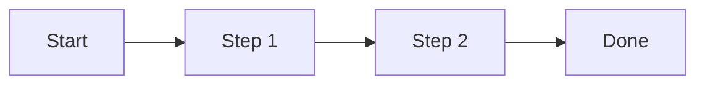
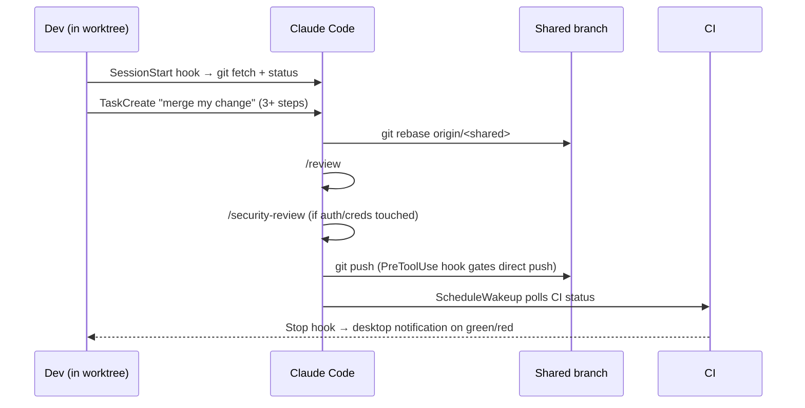

# Github integrtion plan

**Status:** DRAFT — awaiting review
**Author:** you
**Created:** 2026-05-21

> Write the plan before you write the code. Approve it. Then ship.

## 1. Problem

What problem does this plan solve? One paragraph.

## 2. Approach

How are you going to solve it? Constraints, assumptions, trade-offs.

- **Worktree per developer** — each dev runs Claude Code in their own git worktree (`EnterWorktree`) off the shared branch, so parallel experiments don't clobber each other's working tree.
- **Shared conventions via auto-memory** — record team rules (commit style, review expectations, who owns which module) in project memory so every dev's Claude session starts with the same context instead of re-explaining.
- **`/init` once per repo** — generate a CLAUDE.md that all devs commit, so subagents on every machine pick up the same project guidance.

- **Per-dev background CI watcher** — each dev runs a background agent (or `/loop` on the CI status) so they're notified the moment their push breaks the shared branch, instead of finding out from a teammate.

- **Merge handshake as a tracked task** — each dev wraps their merge in `TaskCreate` (rebase → `/review` → `/security-review` → push) so progress is visible and partial failures are recoverable.
- **Shared-branch CI polling** — use `ScheduleWakeup` (or `/loop` on `gh run list`) to poll CI after push; pair with a `Stop` hook for a desktop notification when the run finishes, so devs aren't blocking on tabs.
- **`claude-code-guide` subagent for onboarding** — when a new dev joins the branch, point them at this subagent to learn the hook/worktree setup instead of re-explaining it each time.

## 3. Files to change

- create path/to/new-file.ts
- modify path/to/existing-file.ts
- delete path/to/old-file.ts

Adeptly checks each path against the codebase and warns on mismatches.

## 4. Flow

## 5. Risks

- Risk 1 — mitigation.

- **Risk: concurrent edits to the same file** — mitigate with a `PreToolUse` hook that blocks Edits to hot files (e.g. `package-lock.json`, migration files) unless the dev has rebased in the last hour.
- **Risk: accidental push to shared branch** — `PreToolUse` hook that blocks `git push origin <shared-branch>` without an explicit override flag.
- **Risk: untested code reaching the branch** — require `/review` and `/security-review` before each merge; consider a `PostToolUse` hook that runs the test suite after edits to critical paths.
- **Risk: stale local state** — `SessionStart` hook that runs `git fetch && git status` so each dev sees divergence from origin as soon as they open Claude Code.

## 6. Approval

Approve in the panel below when ready.
