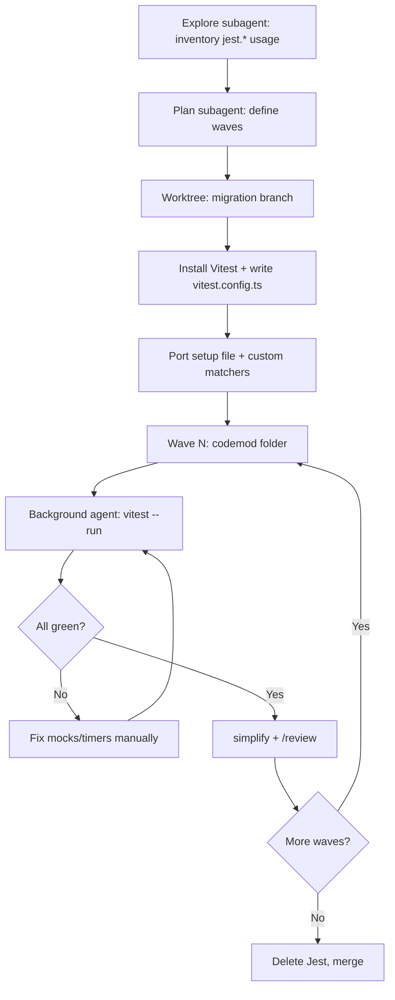

# Migrate Jest to Vitest

## 1. Problem

Our TypeScript codebase has ~200 test files written against Jest. We want to move to Vitest for faster runs, native ESM, and better Vite integration. The hard part isn't swapping the runner — it's the long tail of mocks: `jest.mock`, `jest.fn`, `jest.spyOn`, module factories, timer mocks, and a few custom matchers. We need a migration that lands incrementally without leaving the suite half-green for weeks.

## 2. Approach

Start in **Plan Mode** so we agree on the strategy before touching code. Kick off with the **Explore subagent** (breadth: very thorough) to inventory every `jest.*` call, custom matcher, `setupTests` file, and any non-trivial mock factory — this tells us the true blast radius. Feed that inventory to the **Plan subagent** to decide on batching: setup files first, then per-folder waves.

Do the bulk transform with codemods (`jest-codemods` / `@vitest/codemods`) but expect manual fixes for module mocks and timer behaviour. Use **Worktree isolation** so the migration branch never blocks ongoing feature work. Wave runs go through a **Background agent** running `vitest --run` so you keep iterating while the suite churns.

After each wave, the **simplify skill** does a quality pass on the changed files, then **/review** before merging the wave PR. Save Vitest conventions (mock patterns, config shape) to **Auto-memory** so future sessions don't re-derive them.

## 3. Files to change

- `package.json` — replace `jest` deps with `vitest`, `@vitest/coverage-v8`, update scripts
- `jest.config.*` → `vitest.config.ts`
- `tsconfig.json` — add `"types": ["vitest/globals"]` if using globals
- `src/test/setup.ts` — port `jest.setup` hooks and custom matchers
- All `*.test.ts` / `*.spec.ts` — `jest.*` → `vi.*`, update mock factories
- CI workflow — swap `jest` invocations for `vitest run`

## 4. Flow

## 5. Risks

- **Module mock semantics differ.** `jest.mock` hoists; `vi.mock` hoists too but factory closures behave differently. Catch these with a **Background agent** re-running each wave's suite.
- **Fake timers diverge.** `jest.useFakeTimers('modern')` vs `vi.useFakeTimers()` — audit timer-heavy tests explicitly during the Explore pass.
- **Coverage thresholds drift** when switching from istanbul to v8 — recalibrate before failing CI.
- **Long-running migration branch rots.** Mitigate with short waves and frequent merges back to `main`.
- Run **/security-review** on the final PR if any test touches auth fixtures or credential mocks.

## 6. Approval

Ready to proceed? Approve to exit Plan Mode and begin the Explore inventory pass.
