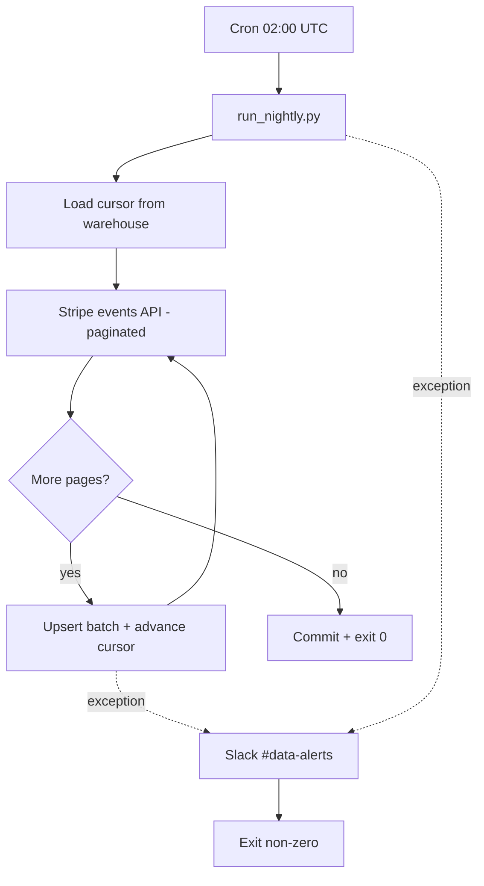

# Nightly Stripe → Postgres ETL

## 1. Problem

Analytics needs Stripe data (charges, subscriptions, refunds, disputes, payouts) inside our Postgres warehouse, refreshed daily. Today the team exports CSVs by hand, which is slow, error-prone, and gives stale numbers by mid-morning. We need a reliable nightly job at 02:00 that lands new Stripe events into warehouse tables and pages us in Slack when something breaks — silence on failure is the worst outcome.

## 2. Approach

Start in Plan Mode and let the Plan subagent draft the architecture before any code lands — this touches ingestion, schema, scheduling, and alerting, so it's well past the 3-file threshold. Use the Explore subagent (medium breadth) to find existing Postgres connection helpers, secret-loading patterns, and any prior Stripe client code we can reuse instead of duplicating.

Build an idempotent extractor that paginates the Stripe `events` API using a stored `last_event_id` cursor, normalizes payloads, and upserts into `warehouse.stripe_events` plus typed projection tables. Wrap the run in a transaction per batch so a mid-run failure leaves a clean cursor.

Schedule it with cron (or our existing orchestrator) at 02:00 UTC. On non-zero exit, post to the `#data-alerts` Slack webhook with the run ID, failure stage, and last successful cursor.

Because this code touches a third-party API key and writes to the warehouse, run /security-review before merging, then /review for a general quality pass. Finish with the simplify skill to catch dead code and over-abstraction before commit.

## 3. Files to change

- `etl/stripe/extract.py` — paginated Stripe events fetcher with cursor
- `etl/stripe/load.py` — upsert into warehouse tables
- `etl/stripe/run_nightly.py` — entrypoint, exit codes, Slack alert
- `migrations/2026XXXX_stripe_events.sql` — `stripe_events` + projections
- `infra/cron/stripe_etl.cron` — 02:00 schedule
- `.env.example` — `STRIPE_API_KEY`, `SLACK_WEBHOOK_URL`, `WAREHOUSE_DSN`

## 4. Flow

## 5. Risks

- **Silent failure**: cron swallowing stderr. Mitigate by wrapping the entrypoint so any non-zero exit hits Slack, and use /schedule to add a daily 09:00 "did last night's run succeed?" check that pings us if the run row is missing.
- **Stripe API drift / rate limits**: pin the Stripe SDK version and handle 429s with backoff.
- **Secret leakage**: `STRIPE_API_KEY` must come from the secret manager, never `.env` in repo. /security-review should specifically check this and the Slack webhook handling.
- **Cursor corruption**: a partial write that advances the cursor past unprocessed events. Mitigate with a single transaction per batch (advance cursor + insert rows together).
- **Timezone confusion**: standardize on UTC everywhere — cron, Stripe timestamps, warehouse columns.

## 6. Approval

Ready to start in Plan Mode once you approve. Confirm the warehouse target schema name and the Slack channel before I scaffold migrations.
