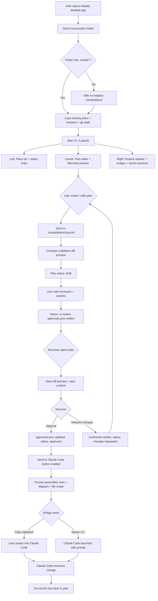

# v0 Product Plan — Adeptly

**Status:** DRAFT — awaiting review
**Author:** Jai
**Created:** 2026-05-18
**Reviewers needed:** Ben, Matt, Alex, Vee, Magesh (mark approval at bottom of doc)
**Pre-flight checklist:** see §10 — every box must be ticked before any code change is shipped to users

> **Name:** Adeptly. Domain `adeptly.dev` (confirmed available via DNS lookup 2026-05-18 — register on Namecheap/Porkbun, ~$12/year). Tagline: *"Use Claude Code properly. Plan first, ship sharper."*

---

## 1. Problem

Most developers who use Claude Code use it as a chat box in a terminal. They ask questions, paste files, accept answers. They never discover:

- **Plan mode** — write a plan first, get review, then code
- **Subagents** — spawn specialised agents (Explore, Plan, code-reviewer) for parallelisable work
- **Skills** — `/init`, `/security-review`, `/review`, custom skills
- **Hooks** — settings.json automation that fires on tool events
- **MCP servers** — extending Claude Code with custom tools
- **Memory** — persistent facts across sessions
- **`/resume`** — continue any past session by ID

These features are documented but not surfaced in the chat UX. Result: Claude Code is used at maybe 15% of its actual capability, and the work that *does* happen has no review trail because plans are written in chat and lost.

**Concrete user pain (from author's own experience this week):**
- Cannot easily see what *another* Claude Code session is doing.
- Pasting screenshots between sessions is friction-heavy.
- No structured place for plans. They live as scrollback that gets compacted away.
- Multiple devs on one project can't review each other's plans before code changes.

---

## 2. Audience

**Primary:** Solo developers and small dev teams (2–8 people) already using Claude Code who:
- Want a structured plan-first workflow but don't have one.
- Are losing context across sessions and don't know about `/resume` + memory.
- Don't know which Claude Code features apply to which tasks.

**Secondary (later):** Engineering managers who want visibility into AI-assisted work in their team.

**Not the audience (v0):**
- Cursor-only users.
- People who want a new AI editor — we are *not* replacing Claude Code, we sit alongside it.

---

## 3. Differentiation (what exists today, what's missing)

| Existing | What it does | What it doesn't do |
|---|---|---|
| Claude Code CLI | The thing itself — chat, tools, agents, hooks | No UI surface for features; no plan persistence; no team review |
| Claude Code IDE extensions (VS Code, JetBrains) | Embed chat in editor | No plan-first; no team review; same discoverability gap |
| Cursor | AI-native editor | Different product, doesn't use Claude Code's skills/hooks/MCP |
| Aider | OSS pair-programmer CLI | CLI-only, no collaboration |
| Continue.dev | OSS IDE assistant | Same model — no team or plan layer |
| Community wrappers (Claudia, Claude Squad) | GUI shells | Solo, no plan-first, no review |

**What's unfilled — and what we own:**
1. **Plan-first enforcement** — plans (markdown + Mermaid diagrams) are required before code changes; Claude Code is invoked *from* the plan.
2. **Team review of plans** — plans live in the repo, get reviewed PR-style by other devs *before* any code is touched.
3. **Feature discoverability** — UI tiles + contextual nudges that teach Claude Code's hidden features as you work.

No other product owns all three. Several own pieces. Nobody owns the combination.

---

## 4. v0 Scope (all three features, broader v0)

**Shape:** Cross-platform desktop app (Electron + Next.js + TypeScript).

**v0 features:**

1. **Project loader.** Open any local folder that contains a `.claude/` directory and/or `.git/`. The app reads the project state, lists plans, shows git status.

2. **Plan editor.**
   - Markdown editor (CodeMirror or Monaco) with side-by-side preview.
   - Live Mermaid diagram rendering for `mermaid` code blocks.
   - Required plan schema: Problem, Approach, Files-to-change (create/modify/delete), Risks, Reviewers, Approval status.
   - Plans saved as `.md` files in `.claude/plans/<slug>.md` (lives in git).

3. **Codebase-aware diff at plan stage.**
   - When a plan declares "create X, modify Y, delete Z", the panel shows:
     - Which files exist today
     - What the plan says will happen to them
     - Live diff preview (no code is actually changed)
   - Reviewers see this before approving.

4. **Approval workflow.**
   - Each plan has an `approvals.json` sibling tracking reviewer status.
   - Status states: `draft`, `in-review`, `approved`, `changes-requested`.
   - Comments thread inline on the plan markdown (annotations stored separately).

5. **Feature surface (Claude Code feature discoverability).**
   - Always-visible sidebar listing Claude Code's features grouped: Agents, Skills, Hooks, MCP, Memory, `/resume`.
   - Contextual nudges based on plan content:
     - Plan touches 5+ files → "Consider spawning a Plan subagent."
     - Plan touches `.env`, auth, or security-sensitive files → "Run `/security-review` after merge."
     - Plan has many parallel tasks → "Spawn Explore + Plan agents in parallel."
   - Mini-tutorials: one feature per day, dismissible.

6. **"Send to Claude Code" button (the bridge, not the replacement).**
   - Once a plan is approved, the app constructs a prompt that includes the plan markdown + flow diagram + the list of changes, and either:
     - Copies it to the clipboard for the user to paste into their Claude Code session, OR
     - Spawns Claude Code in a new terminal with the prompt prepended (if the user has the CLI on PATH).
   - The actual code changes happen through Claude Code's normal flow. We never edit code directly in v0.

7. **Cross-session visibility (small but high-value feature).**
   - The app reads `~/.claude/projects/<project-slug>/*.jsonl` transcripts.
   - Shows a sidebar "Recent sessions" — one-line summary per session, click to inspect, click to `/resume`.
   - Closes the exact pain the author hit this week.

**Deliberately not in v0:**
- No own LLM integration. We *never* replace Claude Code. The user runs Claude Code; we organise the work around it.
- No cloud sync. Plans live in git, approvals in git, comments in git. Zero infra cost.
- No subscriptions or paid tier. Free OSS for v0.
- No multi-tenancy. v0 is local-first.
- No telemetry without explicit opt-in.

---

## 5. Architecture



---

## 6. Tech stack (all free)

| Layer | Choice | Why |
|---|---|---|
| Desktop shell | **Electron** | Team knows JS/TS already (from Signalyn front-end). Larger bundle (~100MB) than Tauri but zero learning curve. |
| Alternative shell | Tauri (Rust backend) | Smaller (~15MB), faster — *consider in v1 if team wants to learn Rust*. v0 stays on Electron. |
| UI framework | **Next.js 14 (App Router) + React + TypeScript** | Same stack as Signalyn front-end. Reuse. |
| Markdown editor | **CodeMirror 6** | Lightweight, embeddable, customisable. Monaco is heavier. |
| Diagrams | **Mermaid.js** | Render from fenced code blocks. Zero dependencies. |
| Local state | **SQLite via better-sqlite3** | For approvals/comments index. Plan content stays in MD files. |
| File-system access | Electron `fs` + `chokidar` for watching changes | Standard. |
| Git integration | **isomorphic-git** or shell out to `git` | Shell is simpler for v0. |
| Distribution | GitHub Releases + auto-update via `electron-updater` | Free. |
| Landing page | Next.js on **Vercel free tier** | Free. |
| Domain | `adeptly.dev` (confirmed available 2026-05-18) | ~$12/year — only cost item. |

**Total monthly cost while idle:** $0.
**Total one-off cost to ship v0:** ~$15 (domain + minor signing certificate workaround).

---

## 7. Folder structure (the actual project layout)

```
adeptly/
├── README.md
├── LICENSE                          # MIT, makes it OSS day one
├── package.json
├── tsconfig.json
├── docs/
│   ├── plans/                       # All plan MDs (this file lives here)
│   │   ├── v0-product-plan.md       # ← you are here
│   │   └── approvals/
│   │       └── v0-product-plan.json # approval state
│   ├── architecture.md              # Long-form architecture notes
│   └── decisions/                   # ADRs (Architecture Decision Records)
├── apps/
│   ├── desktop/                     # Electron main process
│   │   ├── src/main.ts
│   │   ├── src/preload.ts
│   │   └── ...
│   └── renderer/                    # Next.js renderer (the UI)
│       ├── app/
│       │   ├── projects/
│       │   ├── plans/
│       │   ├── features/            # Feature surface tiles
│       │   └── sessions/            # /resume sidebar
│       ├── components/
│       └── lib/
├── packages/
│   ├── plan-schema/                 # Zod schema for plan front-matter
│   ├── claude-code-bridge/          # Talks to Claude Code CLI
│   └── codebase-diff/               # File-scope diff preview logic
├── landing/                         # Vercel-hosted marketing page
└── scripts/
    └── release.ts
```

---

## 8. Phase plan (3 weeks, evenings/weekends pace)

| Week | Focus | Definition of done |
|---|---|---|
| **Week 1** | Electron skeleton + plan editor + Mermaid preview + project loader | Open a folder, see plans list, edit a plan, see Mermaid render. No Claude Code integration yet. |
| **Week 2** | Codebase diff preview + approval workflow + JSON state files | Submit a plan for review, another dev (you wearing a different hat) approves it, status changes visible. |
| **Week 3** | Feature surface + recent-sessions sidebar + "Send to Claude Code" bridge + landing page | End-to-end: write plan → reviewed → approved → prompt sent to Claude Code → Claude Code makes the change. Landing page live. v0 GitHub release published. |

**Note on pace:** these are weeks of focused evening/weekend work — probably 60–80 hours total. If full-time, this is 1.5 weeks.

---

## 9. Risks

1. **Scope creep.** The "feature surface" is the most expandable piece. Cap nudges at 5 hand-coded rules in v0. No ML, no LLM-driven suggestions. We add those in v1 once we have users.
2. **Electron app signing.** macOS Gatekeeper and Windows SmartScreen flag unsigned apps. Free workaround for v0: ship as a `.zip` with `"open from terminal"` instructions; users will tolerate it for an OSS dev tool. Buy code-signing certificates only when paid revenue starts.
3. **Claude Code CLI compatibility.** The "spawn CLI with prompt" path depends on Claude Code's CLI surface staying stable. Mitigate: implement "copy to clipboard" as the primary bridge mode (works regardless of CLI version); CLI-spawn is a nice-to-have second mode.
4. **"Yet another Claude Code wrapper" perception.** Community is sceptical of wrappers. Mitigate: lead with the team-review angle, not the wrapper angle. Tagline: *"Plan-first Claude Code for teams."*
5. **Distribution.** OSS desktop apps live or die on GitHub stars and Twitter mentions. Mitigate: write a launch blog post that's actually useful (the methodology, not the tool), submit to Hacker News on a Tuesday.

---

## 10. Pre-flight checklist (from Signalyn retrospective)

Every item ticked before v0 ships to anyone other than the author:

- [ ] **Honest capability matrix written** — every feature claimed in README is implemented + tested. No aspirational copy.
- [ ] **Tested on a real codebase** — at minimum, this app is used to plan its own next feature. We eat the dog food.
- [ ] **`cannot_handle` paths exist** — if plan is malformed, missing reviewers, has unresolvable Mermaid, the app says *"this plan can't be submitted yet because X"*, not a silent failure.
- [ ] **Cost cap configured** — N/A for v0 (no LLM calls of our own), but the day we add ML nudges, $50/month cap goes in.
- [ ] **No idle infrastructure** — Vercel free tier for landing, GitHub for everything else. Zero monthly bills.
- [ ] **Demo path rehearsed** — 5-min screen recording made on a real repo by someone other than the author *before* public release.
- [ ] **One clear sentence on the homepage** — *"Plan-first Claude Code for teams. Free, open source, runs on your machine."*
- [ ] **No PR-fakery in the deck** — if a feature doesn't exist, it's on the roadmap page, not the features page.
- [ ] **Single point of failure mapped** — if Jai is the only person who can ship a release, document the release process so Alex can ship one.
- [ ] **Kill criteria written** — if 4 weeks after launch we have <50 stars and <10 active users, pause v1 features and re-evaluate positioning.

---

## 11. Open questions (please answer when reviewing)

1. **Name.** ~~"Helm" vs another?~~ **Decided: Adeptly.** Domain `adeptly.dev` confirmed available 2026-05-18. Register before week 1 starts.
2. **Reviewers for this plan.** Confirm Ben, Matt, Alex, Vee, Magesh are the right list — or is this a Jai-Alex-only project for now?
3. **Repo location.** GitHub under `Thoughtlume` org (same as Signalyn), or a new personal/organisation account? OSS implications.
4. **Licence.** MIT (most permissive, most adoption) vs Apache 2.0 (patent clauses, slightly more business-friendly).
5. **First user.** Is this Jai using it on Signalyn from week 1? Yes/no.
6. **Telemetry.** Anonymous usage stats opt-in from v0, or wait until v1?

---

## 12. Approval status

> When a reviewer approves, append `<name>: approved YYYY-MM-DD` here. When requesting changes, link to the comments. Author re-submits after addressing.

- **Jai (author):** drafted 2026-05-18
- **Ben:** _pending_
- **Matt:** _pending_
- **Alex:** _pending_
- **Vee:** _pending_
- **Magesh:** _pending_

---

## 13. Decision log (Architecture Decision Records, abbreviated)

- **ADR-001 (2026-05-18):** Electron over Tauri for v0. *Reason:* zero Rust learning curve for the team. Revisit in v1.
- **ADR-002 (2026-05-18):** Plans live as `.md` files in git, not in a database. *Reason:* version control, code-review tooling already exists for markdown, zero infra cost.
- **ADR-003 (2026-05-18):** No own LLM integration in v0. *Reason:* Signalyn's lesson — don't multiply dependencies before validating value. The bridge to Claude Code is enough.
- **ADR-004 (2026-05-18):** OSS from day one. *Reason:* portfolio + reputation play. Revenue (if any) comes later via paid team-sync cloud feature, not v0.
- **ADR-005 (2026-05-18):** Name is **Adeptly**, domain `adeptly.dev`. *Reason:* single English word, no Claude-specific lock-in (so we can support other models later), no major brand collision (Adept AI is a distinct word and acquired/dormant), DNS-verified available. Tagline: *"Use Claude Code properly."*
- **ADR-006 (2026-05-18):** v0 ships as a **Next.js dev-server local web app, not an Electron desktop app**. *Reason:* identical functionality for a single-user local audience; Electron adds packaging/signing complexity that isn't justified before user feedback exists. Electron wrapper to be revisited once v0 is being used by developers other than the author. The Next.js app reads/writes the same filesystem an Electron app would, so the migration is mechanical when it happens.
